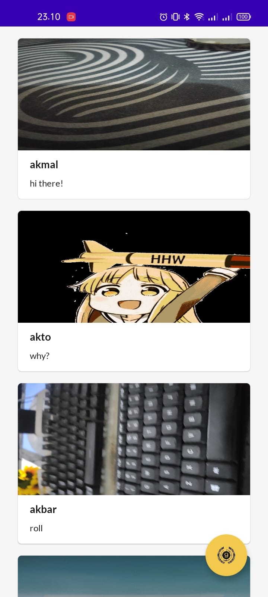

# Android MVVM With Clean Architecture: Story App
This repository implements MVVM architecture using Hilt, Retrofit, and Coil.

  
  
  

 

  
  
  

 
 

  

  <h3 align="center">StoryApp</h3>

  

    I use this repository as a dicoding submission for the "Belajar Pengembangan Aplikasi Android Intermediate" class. 
     
     
    <a href="#">View Demo</a>
    ·
    <a href="https://github.com/codernewbie04/Story-App/issues">Report Bug</a>
    ·
    <a href="https://github.com/codernewbie04/Story-App/issues">Request Feature</a>
  

 

#### The app has following packages:
1. **base**: Refers to a base class or framework that is used as the basis for implementing common and basic functions
2. **data**: It contains all the data accessing and manipulating components.
3. **di**: Dependency providing classes using Hilt.
4. **domain**: This layer contains the core business logic of the application and serves as the entry point for interaction between the presentation and data layers.
5. **ui**: View classes along with their corresponding ViewModel.

